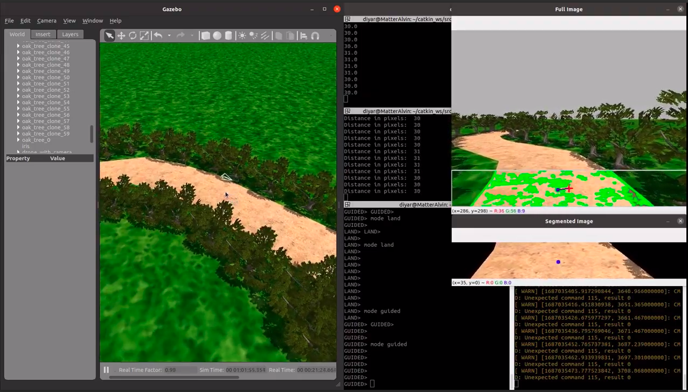
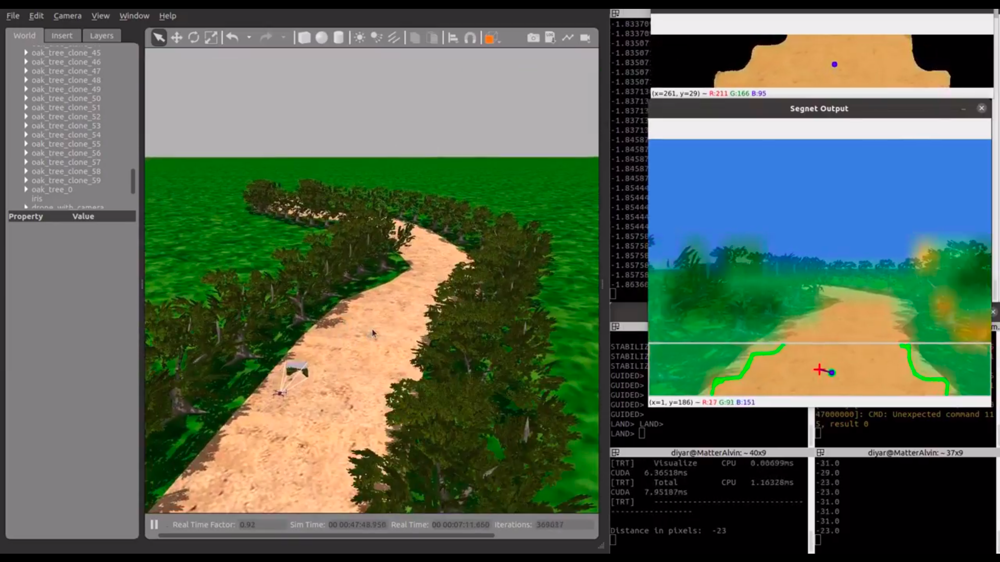
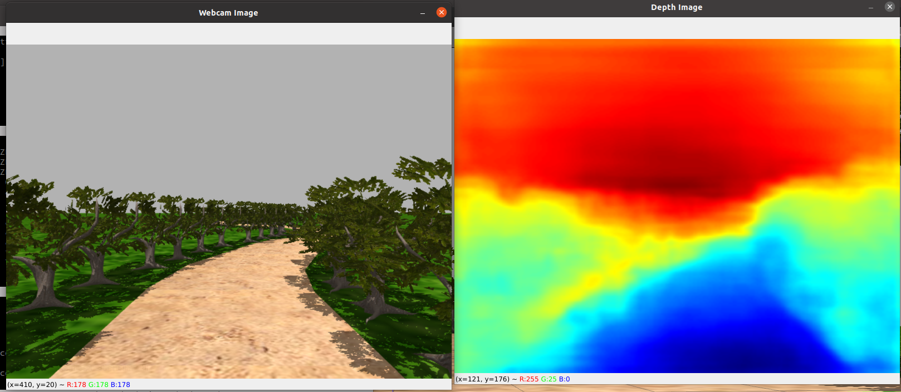

# Gazebo_Segnet_ImageNet
Bu repoda gazebo dünyasından gelen görüntünün segnet ve image kodları bulunmaktadır

Bu kodun çalışması için gerekenler:
Gazebo ve Ros kurulu olmalıdır.

Segnetsiz görüntü:

Segnet ile yaptıktan sonra görüntü:

Dephnet ile işlem yaptıktan sonra görüntü:

